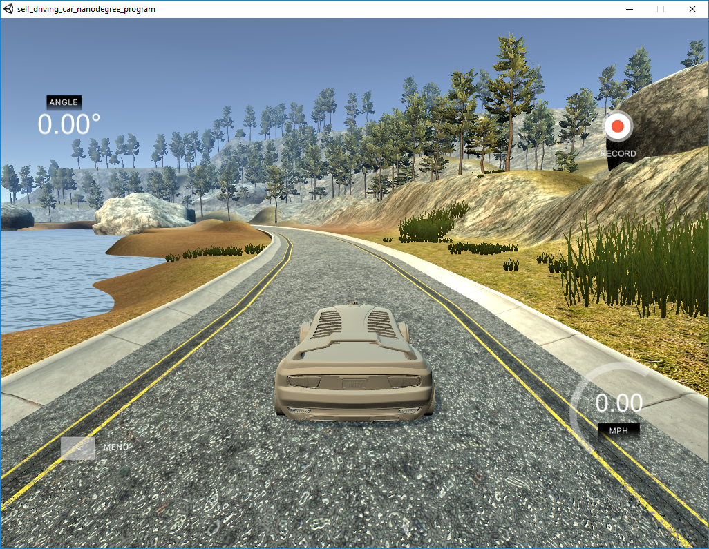
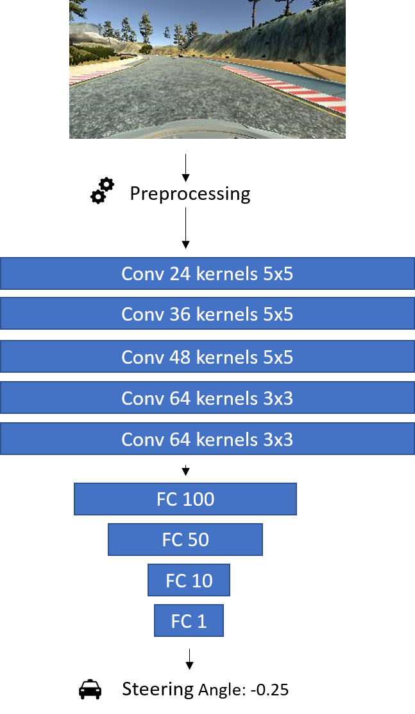

# Autonomous Car Simulation (in progress)

The goal of this project is to train a model driving a car autonomously on the tracks of the Udacity Self-Driving Car Simulator. There is an unfinished approach in tensorflow, but no implementation in pytorch - so I started with my own implementation. :relaxed:

If you are interested in the project or if you want to contribute some ideas or code - feel free to join.

## Udacity Self-Driving Car Simulator

The [Udacity Self-Driving Car Simulator](https://github.com/udacity/self-driving-car-sim) allows to record simualted front and side cameras of the car together with the control data like steering angle, speed, throttle, etc during the training mode. In thesutonomous mode it enables the computer to control the car via event based communication.

## The model

Implemented in [PyTorch](https://pytorch.org/) using Python.

